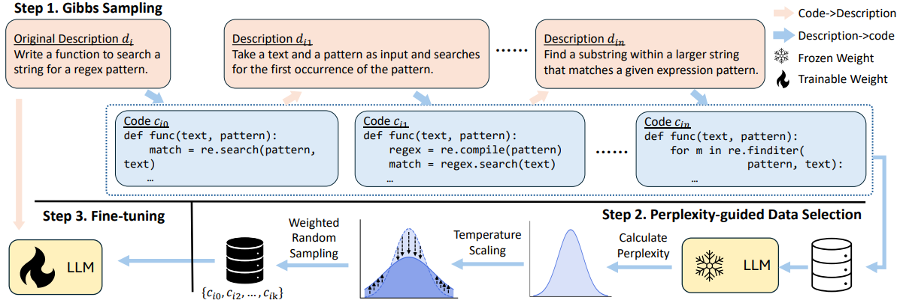

# GiFT: Gibbs Fine-Tuning for Code Generation

This repo contains code for [GiFT: Gibbs Fine-Tuning for Code Generation](https://arxiv.org/abs/2502.11466), 
accepted to ACL 2025. In this codebase we provide instructions for reproducing our results from the paper.
We hope that this work can be useful for future research on generating synthetic data to fine-tune Code LLMs.

## Overview



- Self-training iteratively trains LLMs on self-generated correct code snippets. 
  In this case, the self-generated codes are drawn from a conditional distribution, conditioned on a specific seed description. However, the seed description is not the only valid representation that aligns with its intended meaning. 
  With all valid descriptions and codes forming a joint space, codes drawn from the conditional distribution would lead to an underrepresentation of the full description-code space.
  
- We propose Gibbs Fine-Tuning (GiFT), a novel self-training method inspired by Gibbs sampling. GiFT allows self-generated data to be drawn from the marginal distribution of the joint space, thereby mitigating the biases inherent in conditional sampling. 
  We provide a theoretical analysis demonstrating the potential benefits of fine-tuning LLMs with code derived from the marginal distribution. 
  
- We propose a perplexity-based code selection method to mitigate the imbalanced long-tail distribution of the self-generated codes.

## Environment

```angular2html
conda create -n gift python=3.8 -y
conda activate gift
pip install transformers==4.39.0 datasets==3.1.0 deepspeed==0.15.1 scikit-learn beautifulsoup4
```
Note that we find the experimental results may not be reproducible if we offload the optimizer to CPU in deepspeed.
We strongly recommend to deactivate optimizer offload if CUDA memory is sufficient. 
All of our experiments could be run on a 40GB GPU.

## Pipeline
Here we take DeepSeek-Coder-6.7B-base and APPS+ (Introductory) as an example to demonstrate the pipeline of GiFT.
Note that the codes for each dataset is highly similar, except for the evaluation process. To make code straightforward,
we decided not to merge them together.

### Gibbs Sampling
```angular2html
save_dir=gibbs_sampling
model=deepseek-ai/deepseek-coder-6.7b-base

deepspeed 
--include localhost:0,1,2,3,4,5,6,7 
seq_gibbs_sample.py 
--deepspeed_config ./deepspeed_config.json 
--model_name_or_path ${model} 
--eval_batch_size 1 
--max_length 1536 
--selfsample 
--output_dir ${save_dir}
--num_seq 3 
--temperature 1.0 
--iter_num 20 
--difficulty introductory 
--seed 1234 
```

The self-generated codes will be saved under ```data/introductory/selfsample_code/deepseek-ai/deepseek-coder-6.7b-base```.
The self-generated descriptions will be saved under ```data/introductory/selfsample_sum/deepseek-ai/deepseek-coder-6.7b-base```.

### Calculating Perplexity
```
save_dir=ppl
model=deepseek-ai/deepseek-coder-6.7b-base

deepspeed 
--include localhost:0,1,2,3,4,5,6,7 
cal_ppl.py 
--deepspeed_config ./deepspeed_config.json 
--model_name_or_path ${model} 
--eval_batch_size 1 
--max_length 2048 
--output_dir tmp
--seed 1234 
--selfsample_code_source ./data/introductory/selfsample_code/${model}/passed_seq_code.json 
--difficulty introductory
```
The perplexity of each self-generated code will be saved under the same directory that save self-generated codes.

### Fine-tuning and Evaluation
```
model=deepseek-ai/deepseek-coder-6.7b-base
save_dir=1234-gift-8-re-w2

deepspeed 
--include localhost:0,1,2,3,4,5,6,7 
run_gen.py 
--model_name_or_path ${model} 
--eval_batch_size 2 
--num_epoch 2 
--max_length 1536 
--deepspeed_config ./deepspeed_config.json 
--train_with_seq_gibbs 
--output_dir ${save_dir} 
--selfsample_code_source ./data/introductory/selfsample_code/${model}/passed_seq_code.json 
--num_seq 8 
--seed 1234
--difficulty introductory 
--resample 
--weight_file1 ./data/introductory/selfsample_code/${model}/ppl-passed_seq_code.json 
--temperature 2.0

```

## Citation
If you found this repository useful, please consider citing:
```bibtex
@article{li2025gift,
  title={GiFT: Gibbs Fine-Tuning for Code Generation},
  author={Li, Haochen and Feng, Wanjin and Zhou, Xin and Shen, Zhiqi},
  journal={arXiv preprint arXiv:2502.11466},
  year={2025}
}
```